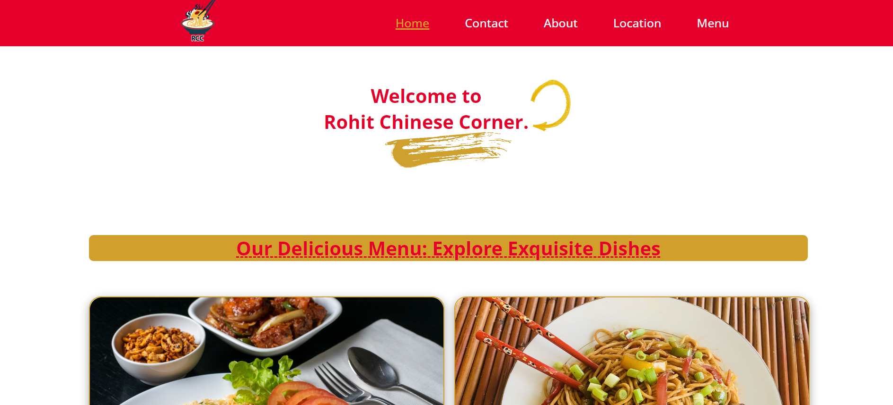
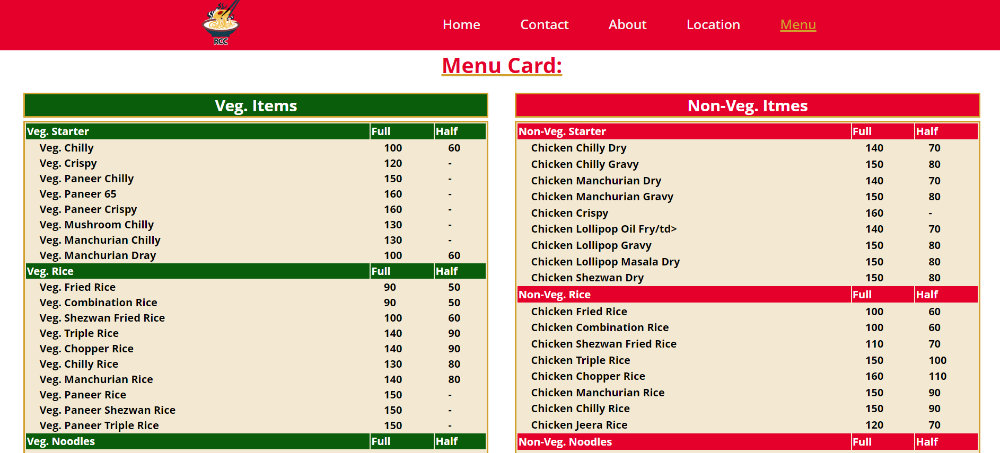
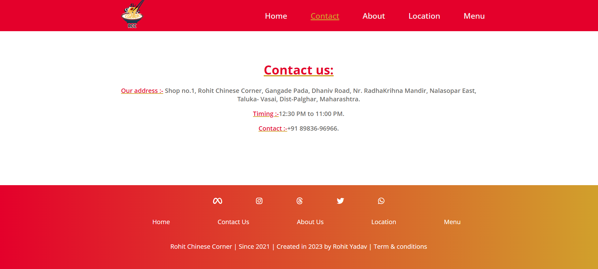
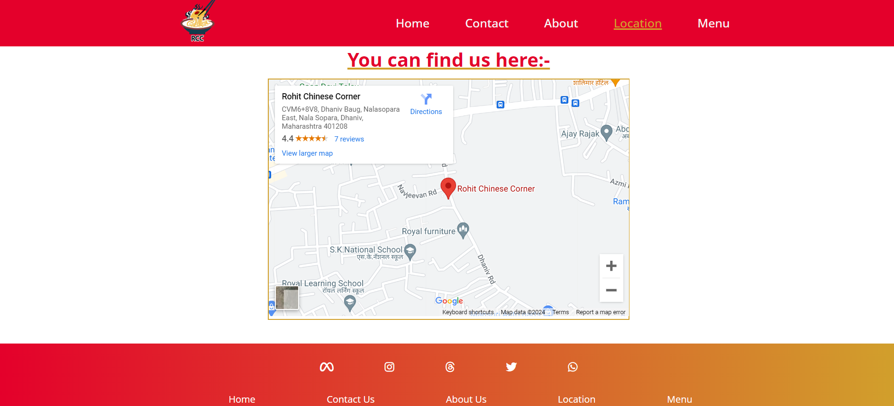

# Project Title:
## Rohit Chinese Corner

## [Netlify Link To Project](https://rohit-chinese-corner.netlify.app/)

```This is a clone of the Bellavita website, where I have used React, React-Router, Context API, Axios, and Chakra UI for the frontend, and json-server for the backend. The project is deployed on Netlify. In this project, I have implemented login and logout functionality, cart functionality, and several product pages.```

## Screenshots

### Homepage


### Menu Page


### Contact-Us Page


### Location Page


### Thank you for visiting my project.
